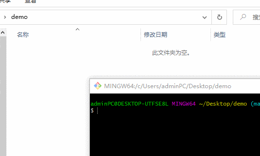

# 版本控制

在学习 Git 工具之前我们要知道什么是版本控制软件？所谓版本控制软件就是一种能够**记录并追踪**一个或者若干个文件内容变化的软件。有了它我们就可以将选定的文件回退到之前任意时间点的状态，还可以比较文件发生的变化以及查出最后是谁修改了哪个地方，从而找出导致问题出现的原因等等。

版本控制系统一般分为三大类：

1. 本地版本控制系统（ 代表作 RCS）。工作原理：简单将文件的修订版本存储到数据库中，利用数据库来记录文件的历次更新差异。缺点是无法多人协同工作。
2. 集中式版本控制系统（代表作 SVN）。工作原理：将文件的修订版本存储到“中央服务器”中，协同工作的人们都可以通过客户端连到这台服务器，取出最新的文件或者提交更新。缺点是中央服务器的单点故障。如果机器崩了一小时，那么在这一小时内，谁都无法提交更新，也就无法协同工作。如果中心数据库所在的磁盘发生损坏，又没有做恰当备份，毫无疑问你将丢失所有数据——包括项目的整个变更历史，只剩下人们在各自机器上保留的单独版本。
3. 分布式版本控制系统（代表作 Git）。进一步优化了集中式版本控制系统的缺点，不用时刻联网，可以脱机使用。每个用户的本地库中都有一个完整的代码历史库，一旦充当“中央服务器”上的代码库挂了，可以复制其它用户上的。因为这里的中央库仅仅起到交换多人代码的作用。

## Git

Git 中文件的状态只有三种：已修改（modified）、已暂存（staged）和已提交（committed）。对应着三个区域：工作区（也就是我们的工作目录 WorkSpacing）、暂存区（像是一个中转站，我们称之为“舞台”stage，每次我们提交的文件都会存在这上面）和仓库（repository，本地仓库，里面存放着各个版本库）。

工作中，一个基本的 Git 工作流程如下：

1. 在工作区中修改文件。
2. 选择性地暂存修改的文件，等待下一步提交。
3. 提交更新。

### Git 及 VSCode 的安装

`Git`以及`VSCode`的安装，直接去 [git 官网](https://git-scm.com/downloads) 和 [VSCode 官网](https://code.visualstudio.com/Download) 下载自己需要的版本，下载之后软件的安装建议采用默认安装路径（windows 系统），以便造成意想不到的后果。

### VSCode 中的 Git 插件

VSCode 虽然集成了 `Git`，但为了更好增加我们的使用效率，推荐安装以下插件：[Git History](https://github.com/DonJayamanne/gitHistoryVSCode)、[GitLens](https://github.com/eamodio/vscode-gitlens)及[Git Graph](https://github.com/mhutchie/vscode-git-graph)。插件设置采用默认即可。

### Git 的基本使用

Git 给我们提供了命令行和图形化界面两种使用方式，这里由于初步使用建议采用命令行方式。

#### 初始化仓库

仓库（repository），可以简单理解成我们项目的目录，这个目录里面的所有文件都会被 Git 管理起来，每个文件的修改、删除，Git 都能跟踪（track）。初始化一个仓库很简单打开终端后在工作目录下使用命令：`git init` 。

这里提供两种方式操作：

1. `Git bash` 终端命令方式。键入命令后 `Git` 会在当前的工作目录中生成一个 `.git` 的隐藏目录。里面存储项目的配置信息及快照。
2. VSCode 中使用快捷键 **ctrl+shift+p** 打开命令面板输入 `git init` 后按回车选择目标文件夹即可。

## 配置用户信息

在初次提交代码之前，必须配置当前提交者的信息，用于区分不同的开发人员，此时项目一旦出了问题就可以及时定位对应的用户。命令为

`git config user.name "用户名"`,和 `git config user.email "用户邮箱"`

命令后面可以添加 `--global` 参数，表示为全局配置，之后该台机器上的所有 git 仓库都会使用该配置。不带该参数则默认表示该配置只对当前仓库有效。

这里提供两种方式操作：

1. 终端命令方式。打开终端后分别输入以上命令即可。
2. 直接点击 VSCode 源代码管理侧边栏中的 `git Graph` 选项，然后点击插件的`repository settings`选项进入仓库的配置界面，最后点击配置界面的 `Add User Details`选项，输入相关信息即可。如下图所示。

这里可以使用命令`git config --list` 查看仓库的所有配置信息，参数`--list`等价于`-l`。

## 本地仓库操作

配置信息，就可以进入正题，使用 git 管理我们的代码了。

### 查看本地仓库文件状态

使用命令 `git status`。该命令会将仓库内所有文件的状态（已追踪的和未追踪的）显示出来。要是嫌输入的内容十分详细，可以在其命令后添加参数 `--short` ，参数 `--short`等价于`-s`。

在 VScode 中查看仓库内每个文件的变化是非常简单和人性化的，直接点击侧边栏中的源代码选项即可。

### 代码提交

将我们所写的代码从工作区提交到本地仓库内非常简单，通常只需要两步：

1. 先添加到暂存区，使用命令 `git add "文件名称"`暂存单个文件；暂存多个文件时可以使用命令：
   - `git add .`，表示暂存所有新文件和已修改的文件，不包括删除的文件。
   - `git add -A`，表示暂存所有文件。
   - `git add -u`，表示暂存所有被修改和被删除文件，不包括新文件。
2. 最后再提交到仓库，使用命令 `git commit -m "本次提交说明"`。参数`-m` 表示对当前提交的版本说明，也可以不添加说明信息，使用命令 `git commit --allow-empty-message --no-edit`，为了代码提交的规范通常不推荐省略。如果什么参数都不带默认打开 Vim 文本编辑器，让用户输入提交信息,先快捷键 `ESC` ，再输入`ZZ`退出。

也可以一步到位，跳过暂存，直接提交到仓库，使用命令 `git commit -a -m "本次提交说明"`。

注意：如果刚刚提交完，发现有漏掉的文件没有添加或者提交的说明信息写错了，可以使用命令 `git commit --amend -m "提价信息"`来重新提交，该命令会将暂存区内文件重新提交。如果自上次提交以来还未做任何修改，那么 `commit id` 会保持不变，修改的仅仅是提交信息.**注意该命令只能作用于当前版本，要想修改其它版本的提交信息可以回滚该版本上再执行该命令**

代码提交没有什么好说的，比较简单。这里说一下 vscode 提交规范插件 [commit-message-editor](https://github.com/bendera/vscode-commit-message-editor) ，成功安装之后，每次提交代码我们都可以使用它来提交和规范提交信息。

### 查看修改的内容

查看修改就是查看改动的文件内容，方便我们对比文件前后发生了那些变化。

#### 查看暂存区与工作区的修改

使用命令 `git diff` 查看文件暂存前后发生的改动。终端命令简单不赘述。

VSCode 中点击右上角 **打开更改** 选项或者点击侧边栏 **源代码管理** 选项 **更改** 中的目标文件。

#### 查看暂存区与最新提交的版本库的修改

使用命令 `git diff --cached`。参数 `--cached` 可以使用 `--staged` 代替。终端命令简单不赘述。VSCode 中只需点击侧边栏 **源代码管理** 选项 **暂存的更改** 中的目标文件即可。
此外，还可以查看当前暂存区与任意一次版本库的修改，使用命令 `git diff --cached commitID` 即可。注意，VSCode 中鼠标右键侧边栏 **暂存的更改** 选项中目标文件上的**open changes** > **open changes with revision**选择要与之对比的版本库即可。此外，对于比较任意两个版本库的区别，可以通过插件[Git History](https://github.com/DonJayamanne/gitHistoryVSCode)查看或者通过 git 命令`git diff commitId1 commitId2`来比较。

#### 查看工作区与最新提交的版本库的修改

使用命令 `git diff HEAD`，终端命令不赘述，

此外还可以查看工作区与任意一次版本库的修改，只需鼠标右键 **更改** 中的目标文件上的 **open changes** > **open changes with Revision**，然后选择需要比较的历史版本库即可。

#### 删除文件

项目中，我们删除文件有两种情况：

（这里删除文件的方式指的是使用命令 `rm "文件名"`或者手动删除）

一种是误删，需要恢复删除的文件：

既然是误删，肯定之前的版本库中有这个文件，所以我们只需要执行撤销操作即可。命令为 `git checkout -- "文件名"` 或者 `git restore "文件名"`。

另外一种，则确实是要删除文件，执行命令 `git rm "文件名"`，然后 **提交** 即可。

有这么一种情况，我们想把文件从 git 仓库中删除（也就是从暂存区删除），但依然希望该文件保留在当前工作区中。可以使用 `git rm --cached "文件名"`，该命令会将文件从暂存区中删除，但依然继续存在本地，只是未被 git 追踪 track。

#### 移动文件

移动文件的终端命令为 `git mv "文件1" "文件2"` 相当于运行了三条命令 `rm "文件1"`、`git rm "文件1"`和 `git add "文件2"`。即删除了文件 1 后又添加了文件 2。

#### 撤销操作

项目之中撤销操也分两种情况，

1. 撤销部分文件操作（工作区内容和暂存区内容）：

   1. 撤销工作区内容。终端中我们只要使用命令 `git restore "文件名"` 或者 `git checkout -- "文件名"`即可。VSCode 中，只需点击侧边栏中的源代码管理目标文件上的 **+**、**-** 即可。
   2. 撤销暂存区内容。使用命令 `git restore --staged "文件名"` 或者 `git reset HEAD "文件名"`。

2. 撤销版本库，也叫版本回滚。

使用命令 `git reset HEAD^ `。参数 `HEAD` 表示当前版本库，上一个版本就是`HEAD^`，上上一个版本就是`HEAD^^`，依次类推。回退到指定版本使用命令`git reset --hard commitId`。这里的`commitId`可以使用**查看历史命令**`git reflog` 来确定。
版本回滚时，参数的不同决定了代码库回滚的程度。

1. `--soft` ，仅仅是移动了 HEAD 指针的指向，保留当前暂存区和工作区，其代码库中所有的代码内容都没有发送改变，其生成的副本内容与当前代码库中的内容一致，只是文件都变成待提交状态（即处于暂存区内）。
2. `--mixed` ，为`git reset`命令的默认参数，表示重置当前暂存区，保留当前工作区的文件内容。
3. `--hard` ，表示重置当前的暂存区和工作区。其当前代码库中所有的更改都会被删除，其生成的副本代码库内容与 `commitId` 中的代码库内容一致。

### 分支操作

所谓分支就是类似于工厂里的"流水线"，每个“流水线”上任务都是拥有不同的需求，她们之间是互不干扰的。所以创建不同的分支方便我们开发不同的需求，待开发完成在合并一起就好了。

#### 创建分支

终端命令为 `git branch "分支名"`，VSCode 中，调起命令面板后输入`git branch`后，选择自己需要的方式即可

#### 切换分支

终端命令为 `git checkout "分支名"`或者`git switch "分支名"`，VSCode 中，点击左下角的**分支**，在弹起的窗口选择创建分支的方式即可。

#### 创建并切换分支

终端命令为 `git checkout -b "分支名"`或者`git switch -c "分支名"`。

#### 合并分支

终端命令为 `git merge "分支名"`，表示将该 **分支名** 合并到当前分支上。

注意：默认情况下 git 会启动**fast forward**快速合并模式。快速合并下不会产生新的提交 commitId，即采用合并前的 commit。

`git merge --no-ff -m "description" "分支名"` ，添加参数 `--no-ff` ,表示进行普通模式合并，该模式合并分支后会创建一个新 的 commit ，所以添加提交说明参数 -m。此时可以看出曾经做过合并操作。

使用`git rebase`，该命令会合并分支，与`git merge "分支名"`不同，该命令可以将历史混乱的提交记录整成直线。

#### 删除分支

1. 删除本地分支：

`git branch -d "分支名"` 该分支已合并。

`git branch -D "分支名"` 该分支未合并。

在不同分支上对同一文件的修改在进行分支合并时可能会造成冲突，需要我们手动解决，取舍修改的内容。

2. 删除远程分支

`git push origin --delete "分支名"`。

#### 查看分支

1. `git branch`，列出本地所有的分支
2. `git branch -a`，列出所有的分支,包括本地和远程。
3. `git branch --remotes`，列出所有的远程分支。
4. `git branch --merged` 查看 哪些 分支 已经合并到当前 分支。
5. `git branch --no-merged ` 查看 所有 分支 还没有合并到当前 分支。
6. `git ls-remote "远程库名"` 或者 `git remote show "远程库名"` 查看远程库的所有远程分支

#### 应用分支 cherry-pick

将指定的提交（commit）应用于当前分支。`git cherry-pick commitId `，可以指定多个`commitId`表示将这些分支上提交的信息应用到当前分支，当执行完 cherry-pick 以后，将会生成一个新的提交；这个新的提交的哈希值和原来的不同。

#### 存储工作现场

`git stash`，使用该命令后会把所有未提交的修改（包括暂存的和非暂存的）都保存起来，方便我们做其他事情。

#### 查看存储

`git stash list`，使用该命令后会把所有的 stashId 显示出来，之后根据这个可以恢复工作。

#### 恢复工作现场

恢复工作现场时有两种情况，

1. 恢复工作现场的同时将存储的内容也删除了，`git stash pop`

2. 恢复工作现场的同时保留 stash 存储的内容，使用`git stash apply`如果后续真的需要删除时使用命令 `git stash drop`。

#### 标签操作

往往 git 生成的`commitId`很长还不容易记忆，所以我们可以通过打标签来区分提交的历史版本库。

##### 创建标签

`git tag "标签名"` ,默认为 HEAD ，也就是当前提交创建标签，也可以为指定 **commitID** 即 `git tag commitID`。

`git tag -a "标签名" -m "description"`, commitID 创建带有说明的标签，-a 参数用于指定标签名，-m 用于指定标签说明文字。

#### 显示标签信息

`git tag` 查看本地所有标签。

`git ls-remote --tags` 查看所有远程标签。

`git show "标签名"` 查看指定标签。

#### 推送标签

`git push origin "标签名"` 推送某个分支到远程。

`git push origin --tags ` 一次性推送所有尚未推送到远程的本地标签.

#### 删除标签

删除本地标签：`git tag -d "标签名"` 。

删除远程标签（需要两步）：

先删除本地标签 `git tag -d "标签名"`,

再删除远程标签 `git push origin :refs/tags/"标签名"`。这里参数`:refs/tags/`可以使用`--delete`代替，如`git push origin --delete "标签名"`。

#### 远程库操作

`git remote -v` 查看远程库信息。

`git clone "远程库地址"` 克隆仓库。默认克隆下来的项目名称与远程库地址中的项目名称一致，可以指定名称。如，`git clone "远程库地址" "自定义项目名称"`。

`git remote add origin(远程仓库别名) "远程仓库地址"` 添加远程仓库。

`git remote remove origin(远程库别名)` 或者 `git remote rm "远程仓库名"`删除远程仓库。

`git remote rename "旧名字" "新名字"` 远程库重命名。

`git switch -c branchName origin/branchName` 在本地创建和远程分支对应的分支。建议本地和远程分支的名称最好一致。因为默认从远程库 clone 下来的库，本地只有 master 主分支，故需要执行此命令。

`git push origin branchName` 推送本地分支到远程。

`git pull` 拉取远程库最新提交内容。相当于使命令`git fetch`和`git merge`.

`git fetch` 拉取远程库最新提交内容（远程库中有但本地没有的信息）。

`git branch --set-upstream-to <branch-name> origin/<branch-name>` 该命令用于使用 git clone 命令时，建立本地分支和远程分支的链接关系。`--set-upstream-to` 等价于 `-u`。注意的是如果执行 git clone 后再执行 git pull 命令后会默认建立本地分支与远程分支的关系，不需要执行该命令。
